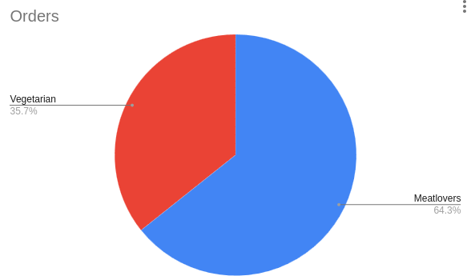
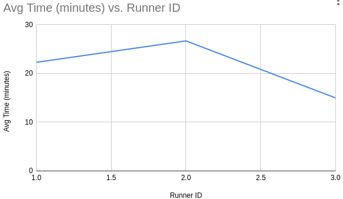
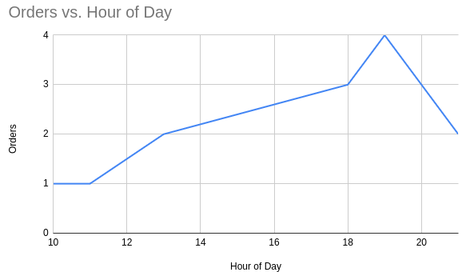

# 🍕 Pizza Delivery Insights – SQL Case Study

A complete SQL-based analysis of a fictional pizza delivery business. This project explores customer behavior, runner performance, and operational efficiency using a cleaned and transformed dataset.

---

## 📊 Project Objectives
- Analyze customer order patterns and preferences
- Evaluate runner performance using delivery metrics
- Uncover trends in operations and identify bottlenecks

---

## 🧰 Tools Used
- SQL (PostgreSQL-compatible)
- Visual Studio Code
- Git + GitHub

---

## 🗂️ File Structure

| File | Description |
|------|-------------|
| `01_data_overview.sql` | Initial data exploration |
| `02_key_metrics.sql` | Key performance indicators |
| `03_delivery_operations.sql` | In-depth delivery and operations analysis |

---

## 🧠 Key Insights
- Identified top-performing runners by delivery speed and volume
- Found popular pizza choices based on order frequency
- Tracked delivery trends by day to optimize scheduling

---

## 🗺️ Entity Relationship Diagram

---

## 📁 Dataset Source
Dataset originally inspired by the open-source case study format, recreated and independently analyzed.

## 10. Appendix

  **Pizza Type Popularity**
  
  

  **Runner Speed Comparison**

  

  **Hourly Order Volume**

  

- **Data Types:** All columns validated for proper types (integers, floats, text)
- **Extra Tables (optional):** Created mock tables like `rating_runners` to simulate advanced extensions

---

## 🙋 Author
KUSH MISHRA  
Connect on GitHub: [m2kush](www.github.com/m2kush)

---

